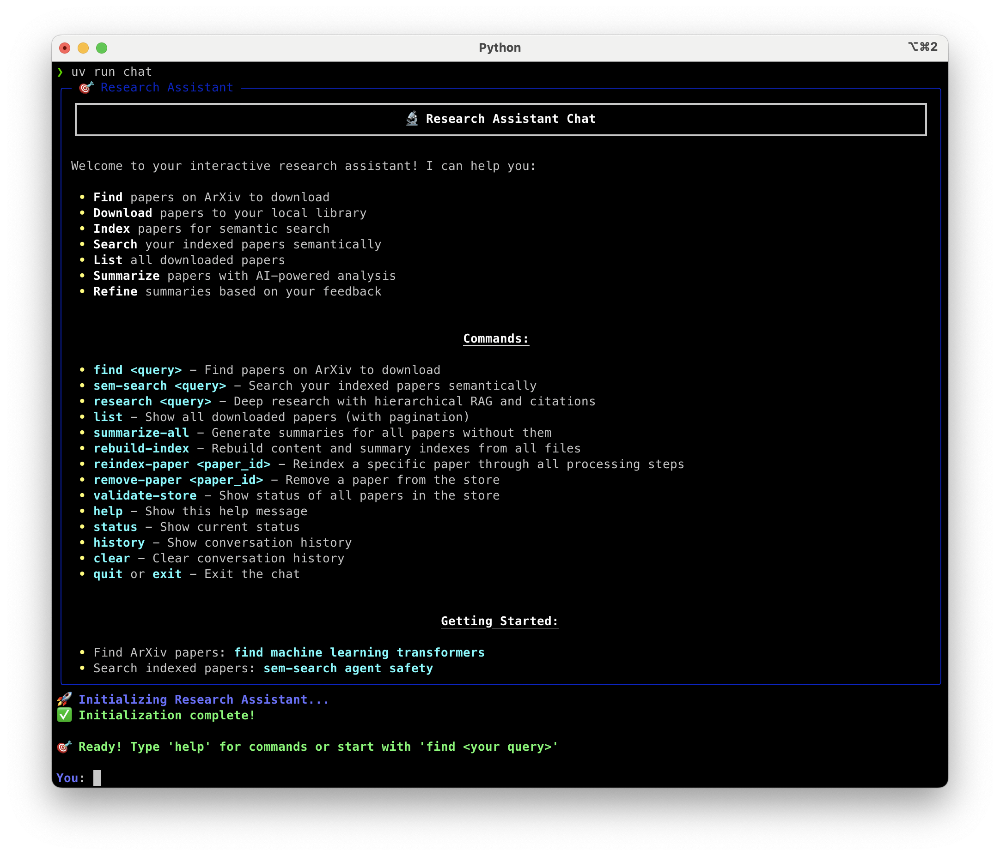
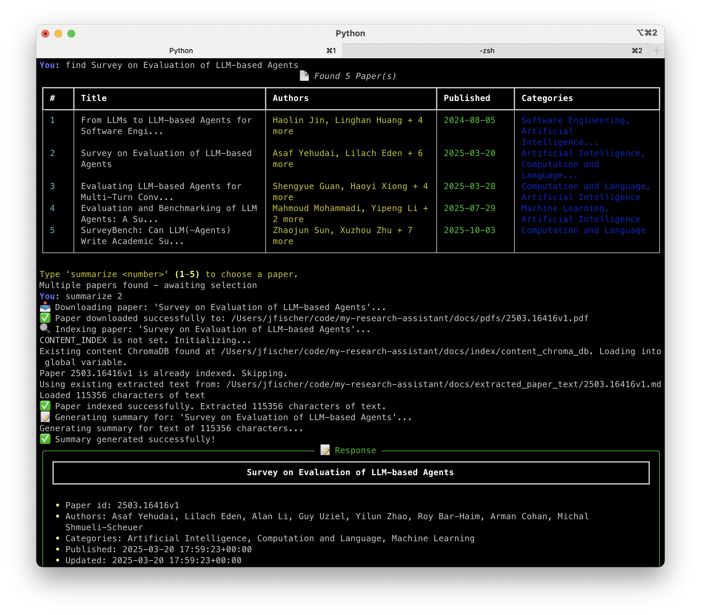
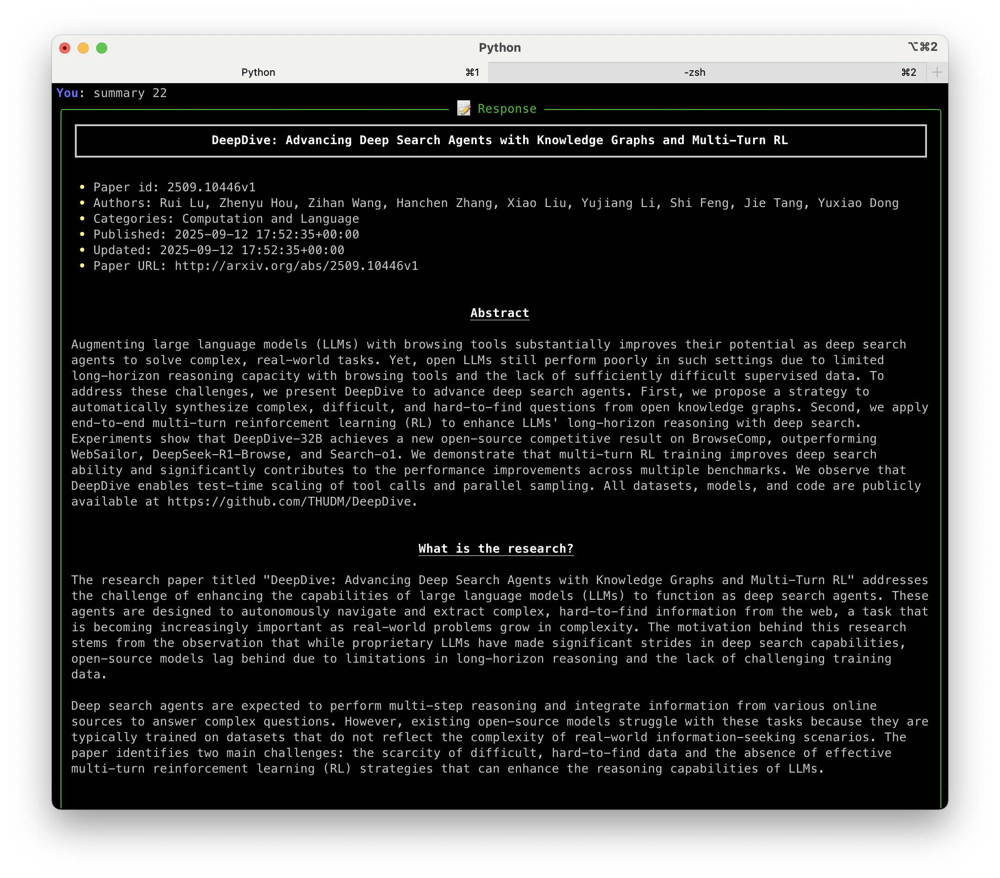
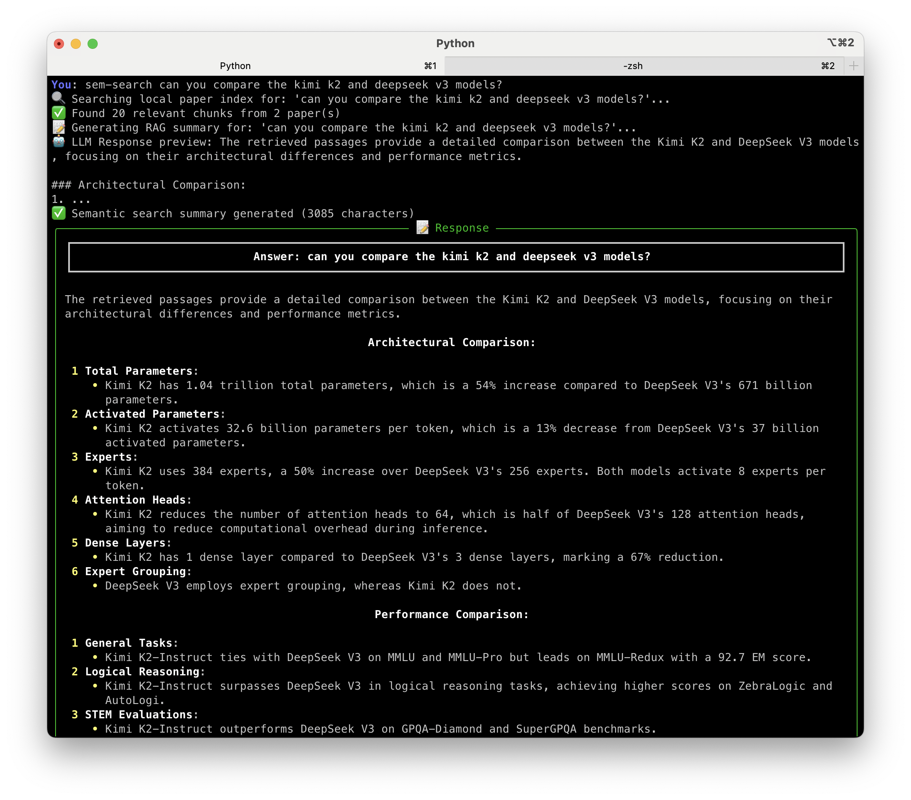
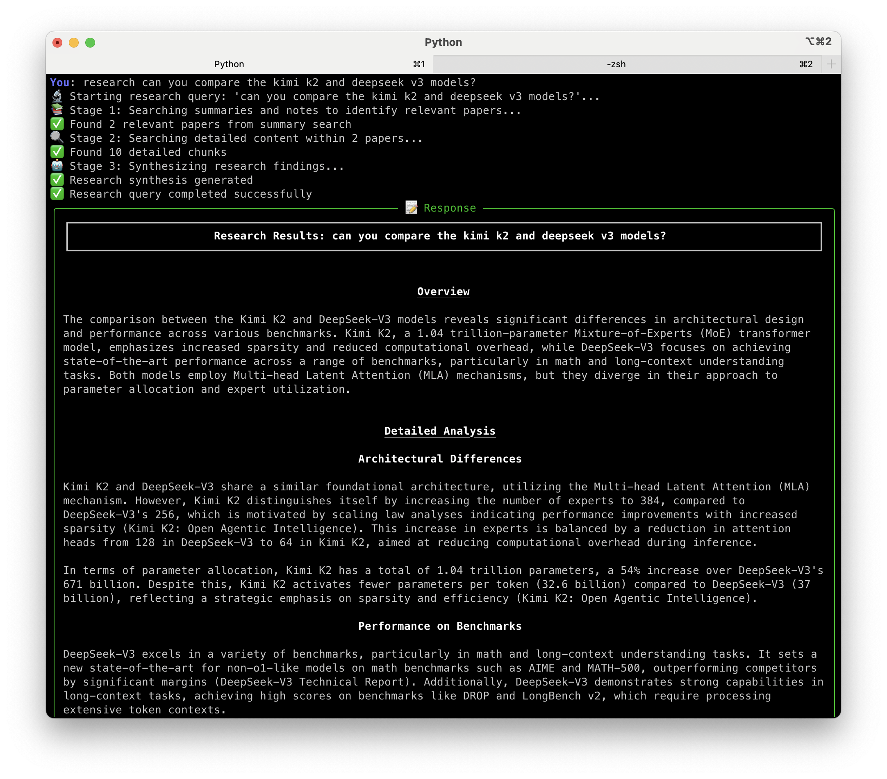
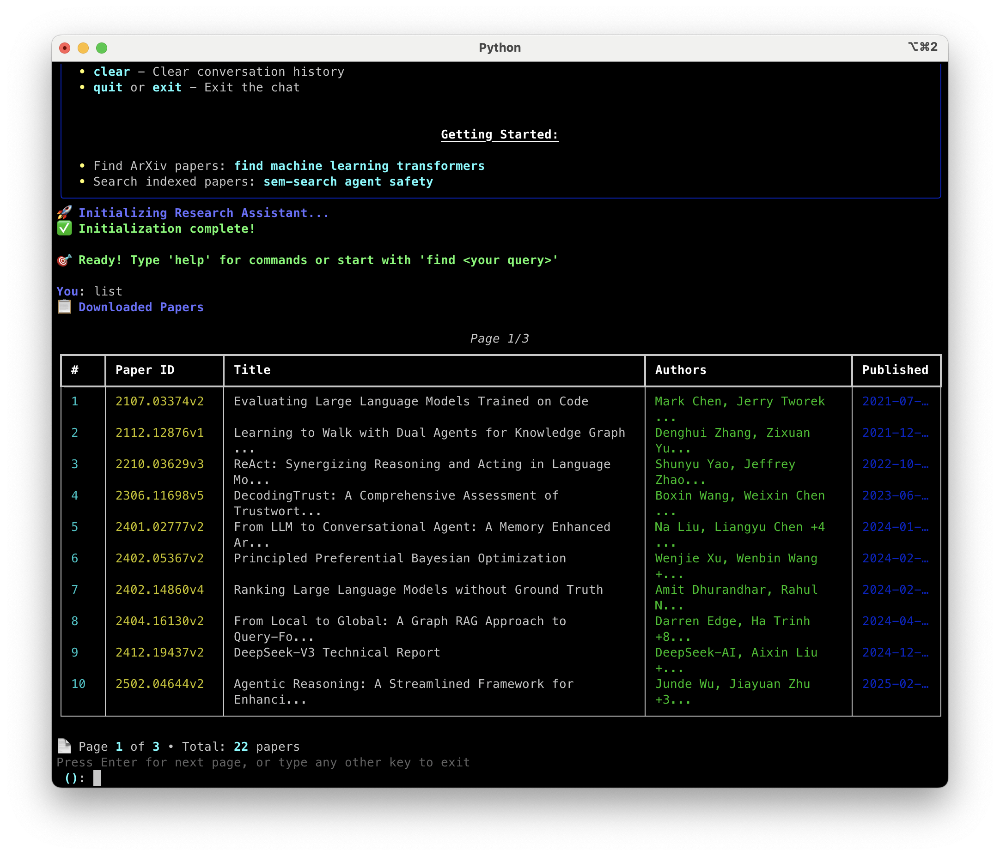

# My Research Assistant

A command-line chatbot agent for building and exploring a knowledge base of research papers from ArXiv. The system provides an interactive terminal interface for finding, downloading, indexing, summarizing, and semantically searching through research papers with LLM-powered capabilities.



## What It Does and Why

Keeping up with the latest research in fast-moving fields like generative AI can be overwhelming. This tool helps researchers:

- **Discover relevant papers** - Search ArXiv with keyword queries and intelligent ranking
- **Build a personal knowledge base** - Download, index, and organize papers locally
- **Generate AI summaries** - Create structured summaries of papers with customizable prompts
- **Perform semantic search** - Find information across your paper collection using natural language queries
- **Conduct deep research** - Use hierarchical RAG (Retrieval-Augmented Generation) to synthesize insights across multiple papers with citations
- **Manage your collection** - Add personal notes, validate storage integrity, and maintain your paper repository

The system uses a state machine-driven workflow with a rich terminal interface, providing visual feedback and markdown rendering for an enhanced research experience.

## Getting Started

### Prerequisites

- **Python 3.12 or higher**
- **OpenAI API key** - Set as `OPENAI_API_KEY` environment variable
- **uv package manager** - Install from [https://docs.astral.sh/uv/](https://docs.astral.sh/uv/)
- **Operating System** - macOS or Linux (Windows not currently supported)

### Installation

1. Clone the repository:
```bash
git clone https://github.com/yourusername/my-research-assistant.git
cd my-research-assistant
```

2. Install uv if you haven't already:
```bash
curl -LsSf https://astral.sh/uv/install.sh | sh
```

3. Install dependencies:
```bash
uv sync
```

4. Set up environment variables:
```bash
export OPENAI_API_KEY='your-api-key-here'
export DOC_HOME='/path/to/your/documents'  # Where papers will be stored
```

Optional environment variables:
```bash
export DEFAULT_MODEL='gpt-4o'  # LLM model to use (default: gpt-4o)
export DEFAULT_EMBEDDING_MODEL='text-embedding-ada-002'  # Embedding model (default: text-embedding-ada-002)
export MODEL_API_BASE='https://api.openai.com/v1'  # API endpoint (default: OpenAI, can use gateway)
export PDF_VIEWER='/usr/bin/open'  # PDF viewer executable (default: terminal viewer)
```

**Note**: The `MODEL_API_BASE` variable allows you to use an API gateway or alternative OpenAI-compatible endpoint. This is useful for load balancing, cost management, or using local model servers.

5. **Optional**: Set up Google Custom Search for enhanced paper discovery:

The `find` command uses Google Custom Search as the primary discovery method when credentials are configured. This provides more reliable and higher-quality search results than the ArXiv API keyword search alone. If credentials are not configured, the system automatically falls back to ArXiv API search.

To enable Google Custom Search:

a. Get a Google Custom Search API key:
   - Go to [Google Cloud Console](https://console.cloud.google.com/)
   - Create or select a project
   - Enable the Custom Search API
   - Create credentials (API key)

b. Create a Custom Search Engine:
   - Go to [Google Programmable Search Engine](https://programmablesearchengine.google.com/)
   - Create a new search engine
   - Configure it to search only `arxiv.org`
   - Copy the Search Engine ID

c. Set environment variables:
   ```bash
   export GOOGLE_SEARCH_API_KEY='your-google-api-key'
   export GOOGLE_SEARCH_ENGINE_ID='your-search-engine-id'
   ```

**Free tier**: Google provides 100 queries/day for free. Each `find` command uses 1 query.

**Troubleshooting**:
- If you see "Google Custom Search failed: API request failed with status code 429", you've exceeded your quota. Wait for the daily reset or upgrade your quota.
- If credentials are not configured, you'll see "Google Custom Search not configured, using ArXiv API search..." in the logs, and the system will use the legacy ArXiv API search method.

### Project File Layout

```
my-research-assistant/
├── src/my_research_assistant/
│   ├── __init__.py
│   ├── chat.py                    # Rich terminal interface
│   ├── state_machine.py           # Workflow state management
│   ├── workflow.py                # LlamaIndex workflow orchestration
│   ├── arxiv_downloader.py        # ArXiv API integration
│   ├── google_search.py           # Google Custom Search integration
│   ├── vector_store.py            # ChromaDB dual vector stores & PDF text extraction
│   ├── summarizer.py              # LLM-powered summarization
│   ├── paper_manager.py           # Paper resolution utilities
│   ├── result_storage.py          # Save/manage research results
│   ├── paper_removal.py           # Remove papers from store
│   ├── validate_store.py          # Store validation
│   ├── prompt.py                  # Template-based prompt system
│   ├── models.py                  # Centralized LLM config
│   ├── file_locations.py          # Storage configuration
│   ├── project_types.py           # Data structures
│   └── prompts/                   # Markdown prompt templates
├── tests/                         # Pytest test suite
├── designs/                       # Design documentation
├── screenshots/                   # Example screenshots
├── pyproject.toml                 # Project configuration
├── LICENSE                        # Apache 2.0 license
└── README.md
```

### Running the Application

Launch the interactive chat interface:
```bash
uv run chat
```

Or run the main module directly:
```bash
uv run python -m my_research_assistant
```

### Example Session

Here's a typical workflow for researching transformer attention mechanisms:



1. **Find papers on ArXiv:**
```
> find transformer attention mechanisms
```
The system searches ArXiv and displays ranked results with titles, authors, and categories.

2. **Summarize a paper:**
```
> summarize 1
```
Downloads the PDF, extracts text, generates an LLM summary, and indexes the content.



3. **View summaries:**
```
> summary 1
```
Displays the structured summary for the selected paper.

4. **Perform semantic search:**
```
> sem-search how does multi-head attention work?
```
Searches across all indexed papers and returns a synthesized answer with page references.



5. **Conduct deep research:**
```
> research what are the key innovations in transformer architectures?
```
Uses hierarchical RAG: searches summaries first, retrieves detailed content from relevant papers, and synthesizes a comprehensive report with citations.



6. **Save results:**
```
> save
```
Saves the research report with an LLM-generated title to the results directory.

7. **Add personal notes:**
```
> notes
```
Opens your editor to add personal notes for the current paper.

8. **List your collection:**
```
> list
```
Displays all downloaded papers with pagination.



## Command Reference

### Discovery Commands
Available from any state.

| Command | Description | Example |
|---------|-------------|---------|
| `find <query>` | Search ArXiv for papers (uses Google Custom Search if configured, otherwise ArXiv API) | `find deep learning optimization` |
| `list` | List all downloaded papers | `list` |

### Paper Processing Commands
Work with individual papers.

| Command | Description | Available From |
|---------|-------------|----------------|
| `summarize <number\|id>` | Download and summarize a paper | After `find` (or any state with ArXiv ID) |
| `summary <number\|id>` | View existing summary | After `list`, `sem-search`, or `research` |
| `open <number\|id>` | View paper content | Same as `summary` |
| `notes` | Edit personal notes | After selecting a paper |
| `improve <feedback>` | Improve current summary/results | While viewing summary or results |

### Search & Research Commands
Available from any state.

| Command | Description | Example |
|---------|-------------|---------|
| `sem-search <query>` | Semantic search across papers | `sem-search attention mechanisms` |
| `research <query>` | Deep research with hierarchical RAG | `research transformer architectures` |
| `save` | Save search/research results | After `sem-search` or `research` |

### Management Commands
System maintenance and utilities.

| Command | Description | Available From |
|---------|-------------|----------------|
| `remove-paper <number\|id>` | Remove paper from repository | Any state |
| `rebuild-index` | Rebuild vector store indexes | Any state |
| `summarize-all` | Generate summaries for all papers | Any state |
| `validate-store` | Check repository integrity | Any state |

### System Commands
Available from any state.

| Command | Description |
|---------|-------------|
| `help` | Show valid commands for current state |
| `status` | Display current workflow status |
| `history` | Show conversation history |
| `clear` | Clear conversation history |
| `quit` or `exit` | Exit the application |

### Paper References

Papers can be referenced in two ways:

1. **By number** (1-indexed): When you have results from `find`, `list`, `sem-search`, or `research`
   ```
   > summary 3  # View summary of paper #3 from current results
   ```

2. **By ArXiv ID**: From any state using the full ArXiv ID
   ```
   > summary 2404.16130v2  # View summary by ArXiv ID
   ```

## Document Store Layout

The system stores all data in a directory specified by the `DOC_HOME` environment variable:

```
${DOC_HOME}/
├── pdfs/                          # Downloaded PDF files
│   └── <arxiv-id>.pdf            # Named using ArXiv conventions
├── paper_metadata/                # ArXiv metadata (JSON)
│   └── <arxiv-id>.json
├── extracted_paper_text/          # Extracted markdown text
│   └── <arxiv-id>.md
├── summaries/                     # LLM-generated summaries
│   ├── <arxiv-id>_summary.md
│   └── images/                    # Extracted figures
│       └── <arxiv-id>/
├── notes/                         # Personal notes (markdown)
│   └── <arxiv-id>_notes.md
├── results/                       # Saved search/research results
│   └── <timestamp>_<title>.md
└── index/                         # ChromaDB vector stores
    ├── content/                   # Paper content chunks
    └── summary/                   # Summaries + notes
```

### Storage States

Papers in your collection can be in different states:

- **Downloaded**: PDF exists in `pdfs/`
- **Extracted**: Text extracted to `extracted_paper_text/`
- **Summarized**: Summary generated in `summaries/`
- **Indexed (content)**: Paper chunks indexed for semantic search
- **Indexed (summary)**: Summary indexed for research

Use `validate-store` to see the status of all papers.

## Implementation Overview

### Architecture

The system uses a **state machine-driven workflow** with a **pipeline architecture** for paper processing:

```
ArXiv Search → Download PDF → Extract Text → Index Content → Generate Summary → Index Summary
```

### Key Components

#### State Machine (`state_machine.py`)
- **6 states**: `initial`, `select-new`, `select-view`, `summarized`, `sem-search`, `research`
- **3 state variables**: `last_query_set`, `selected_paper`, `draft`
- Command validation based on current state
- Conditional query set preservation for seamless navigation

#### Dual Vector Stores (`vector_store.py`)
- **Content index**: Chunks from paper PDFs for semantic search
- **Summary index**: Summaries + personal notes for research
- ChromaDB backend with persistent storage
- Metadata enrichment with ArXiv categories, authors, and page numbers

#### LlamaIndex Workflow (`workflow.py`)
- Event-driven pipeline for paper processing
- Structured result objects (`QueryResult`, `ProcessingResult`, `SaveResult`)
- Async workflow support for efficient operations
- Integration with OpenAI embeddings and LLMs

#### Search & Retrieval Strategy
1. **Keyword Search**: Google Custom Search (if configured) or ArXiv API for candidate papers
2. **Version Deduplication**: Automatic selection of latest paper versions when multiple versions found
3. **Semantic Reranking**: LlamaIndex embeddings for similarity ranking
4. **Paper ID Sorting**: Results sorted by ArXiv ID for consistent numbering across commands
5. **Hierarchical RAG**: Summary-level search → targeted content retrieval → synthesis

#### Prompt System (`prompt.py`)
- Template-based markdown prompts in `src/my_research_assistant/prompts/`
- Variable substitution with `{{VAR_NAME}}` syntax
- Versioned prompts (v1, v2) for base summaries and improvements
- Centralized management for consistency

### Core Data Flow

1. **Search**: ArXiv API → metadata extraction → semantic reranking
2. **Download**: PDF retrieval → local storage in `pdfs/`
3. **Extract**: PyMuPDF → markdown text + images
4. **Index**: Document chunking → embeddings → ChromaDB storage
5. **Summarize**: LLM with versioned prompts → markdown summary
6. **Search/Research**: Query → vector similarity → LLM synthesis → citations

### Testing

Comprehensive test suite with pytest:

- **State machine tests**: 30+ tests covering all workflows and transitions
- **Command tests**: Integration tests for chat interface
- **Component tests**: Unit tests for individual modules
- **Mock-based testing**: Isolated component testing
- **Async support**: `pytest-asyncio` for workflow testing

Run tests:
```bash
uv run pytest
uv run pytest -v  # Verbose output
uv run pytest tests/test_state_machine.py  # Specific test file
```

### Error Handling

- **Custom exceptions**: `IndexError`, `ConfigError`, `PromptFileError`, `PromptVarError`
- **State machine recovery**: Automatic transitions to safe states on failures
- **Graceful fallbacks**: Text-based similarity when embedding fails
- **Robust validation**: File existence checks before operations
- **Structured errors**: Detailed error messages in result objects

### Model Configuration

- **Centralized config** via `models.py`
- **Environment-based selection**:
  - `DEFAULT_MODEL` - LLM model name (defaults to `gpt-4o`)
  - `DEFAULT_EMBEDDING_MODEL` - Embedding model (defaults to `text-embedding-ada-002`)
  - `MODEL_API_BASE` - API endpoint URL (defaults to OpenAI, supports API gateways)
  - `OPENAI_API_KEY` - API authentication key
- **OpenAI integration**: Configurable model parameters
- **API gateway support**: Use `MODEL_API_BASE` to route through proxies or local servers
- **Caching support**: Performance optimization for repeated queries

## Development

### Running Tests

```bash
# Run all tests
uv run pytest

# Run with verbose output
uv run pytest -v

# Run specific test file
uv run pytest tests/test_summarizer.py

# Run tests for a specific function
uv run pytest -k test_state_machine_transitions
```

### Code Coverage

The project uses `pytest-cov` to measure test coverage. Here are the common commands:

```bash
# Basic coverage report
uv run pytest --cov=my_research_assistant

# Coverage with missing lines (recommended)
uv run pytest --cov=my_research_assistant --cov-report=term-missing
```

This shows which specific lines aren't covered by tests, making it easy to identify gaps.

```bash
# Generate HTML coverage report
uv run pytest --cov=my_research_assistant --cov-report=html
```

This creates an interactive HTML report in `htmlcov/index.html` that you can open in a browser for detailed coverage analysis.

```bash
# Combined terminal + HTML reports
uv run pytest --cov=my_research_assistant --cov-report=term-missing --cov-report=html
```

This gives you both the terminal summary and the detailed HTML report.

### Adding Dependencies

```bash
# Add runtime dependency
uv add <package-name>

# Add dev dependency
uv add --group dev <package-name>
```

### Code Structure

- Write new unit tests in `tests/` rather than creating throwaway tests
- Use `FileLocations` to override default locations in tests (prevents modifying `docs/`)
- Follow existing patterns for state machine integration
- Use structured result objects for workflow methods

### Design Documents

The `designs/` directory contains comprehensive design documentation:

- `workflow-state-machine-and-commands.md` - State machine specification
- `command-arguments.md` - Paper argument parsing
- `research-command.md` - Hierarchical RAG design
- `file-store.md` - Data storage architecture
- `user-stores.md` - User operations and workflows

## Contributing

Contributions are welcome! This project is in early development. Please:

1. Fork the repository
2. Create a feature branch
3. Write tests for new functionality
4. Ensure all tests pass with `uv run pytest`
5. Submit a pull request

## License

Copyright 2025 Benedat LLC

Licensed under the Apache License, Version 2.0 (the "License");
you may not use this file except in compliance with the License.
You may obtain a copy of the License at

    http://www.apache.org/licenses/LICENSE-2.0

Unless required by applicable law or agreed to in writing, software
distributed under the License is distributed on an "AS IS" BASIS,
WITHOUT WARRANTIES OR CONDITIONS OF ANY KIND, either express or implied.
See the License for the specific language governing permissions and
limitations under the License.

## Acknowledgments

Built with:
- [LlamaIndex](https://www.llamaindex.ai/) - Workflow orchestration and RAG
- [ChromaDB](https://www.trychroma.com/) - Vector database
- [Rich](https://rich.readthedocs.io/) - Terminal interface
- [PyMuPDF](https://pymupdf.readthedocs.io/) - PDF processing
- [ArXiv API](https://arxiv.org/help/api/) - Paper metadata and downloads
